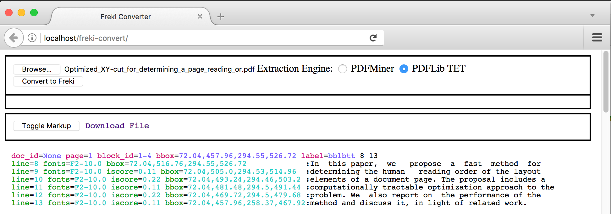

# Freki Converter

This package provides a simple Flask module for running a web service for extracting text from PDF documents using [PDFLib TET](https://www.pdflib.com/products/tet/) or [PDFMiner](https://github.com/euske/pdfminer) and reanalyzing them with the [Freki](https://github.com/xigt/freki) reanalysis tool.

The interface provides:

* Conversion capability
* Syntax highlighting
* Ability to toggle "preambles" off and on.

## Dependencies

* [Freki](https://github.com/xigt/freki) - For performing reanalysis
* One of either engine:
  * [PDFMiner](https://github.com/euske/pdfminer)
  * [PDFLib TET](https://www.pdflib.com/products/tet/)

## Example Interface Screenshot

